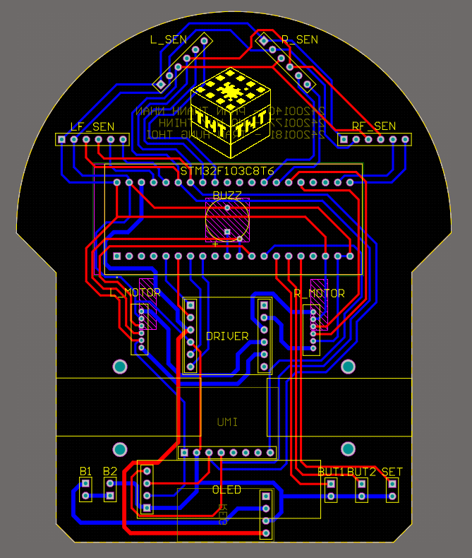

# TNT
Micromouse TNT
Poweredd by hopes and dreams from ChatGPT code.

This mouse use an STM32F103C8T6 (Bluepill) as the microcontroller, 4 VL53L0X TOF sensors to detect walls, MPU6050 for mouse orientation, DRV8833 driver with 2 N20 motors with encoder for movement and calculate distance, an SSD1306 Oled screen and buzzer for debugging.

